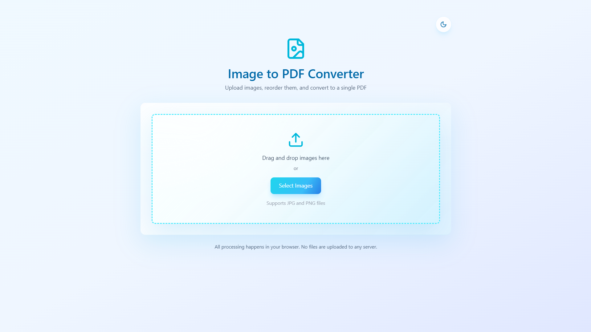
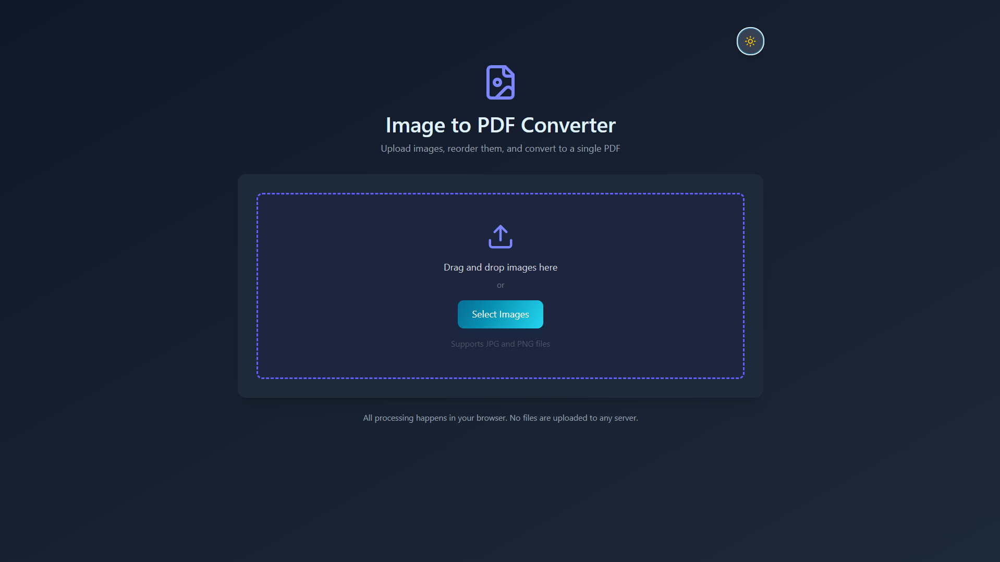

# Image to PDF Converter

A modern client-side web app for converting JPG and PNG images into a single PDF file. The app is built with React, TypeScript, Vite, Tailwind CSS, react-dnd, and jsPDF.

Everything runs directly in the browser. Your images are not uploaded to any server.

## Preview

### Light Mode



### Dark Mode



## Features

- Convert multiple JPG and PNG images into one PDF file.
- Preview selected images before exporting.
- Reorder images with drag and drop to control PDF page order.
- Remove individual images from the selection.
- Clear all selected images with a smooth collapse animation.
- Download the generated PDF directly from the browser.
- Light and dark theme support.
- Polished light mode with a soft blue glassmorphism style.
- Animated gradient buttons for primary actions.
- Smooth entry animations for image previews and the download panel.
- Theme toggle icon animation on hover and click.
- Local-only processing for better privacy.

## Tech Stack

- React 18 for building the UI.
- TypeScript for type-safe app logic.
- Vite for fast local development and production builds.
- Tailwind CSS 4 for utility-first styling.
- tw-animate-css for animation support.
- react-dnd and react-dnd-html5-backend for drag-and-drop sorting.
- jsPDF for generating PDF files in the browser.
- lucide-react for clean, lightweight icons.


## Getting Started

### Prerequisites

Install Node.js and npm before running the project.

Recommended:

- Node.js 18 or newer
- npm 9 or newer

### Installation

```bash
npm install
```

### Run in Development

```bash
npm run dev
```

Then open the local URL shown in the terminal, usually:

```text
http://localhost:5173/
```

### Build for Production

```bash
npm run build
```

The production output will be generated in the `dist/` folder.

### Preview the Production Build

```bash
npm run preview
```

## How to Use

1. Open the app in your browser.
2. Drag and drop JPG or PNG images into the upload area, or click `Select Images`.
3. Review the selected image previews.
4. Drag images to reorder them if needed.
5. Remove individual images with the close button, or use `Clear All` to reset the list.
6. Click `Convert to PDF`.
7. Click `Download PDF` when the PDF is ready.

## Supported Files

The app currently supports:

- `.jpg`
- `.jpeg`
- `.png`

The exported file is downloaded as:

```text
converted.pdf
```

## Project Structure

```text
ImageToPDF/
  images/
    light.png                 # Light mode screenshot
    dark.png                  # Dark mode screenshot
  src/
    app/
      App.tsx                 # Main app UI, state, drag/drop, PDF conversion
      Attributions.md
    styles/
      index.css               # Tailwind entry file
      default_theme.css       # Theme tokens
      globals.css             # Base styles and custom animations
    main.tsx                  # React entry point
    vite-env.d.ts
  index.html
  package.json
  vite.config.ts
  tsconfig.json
```

## Main App Flow

The core workflow is handled in `src/app/App.tsx`:

- Selected images are stored in React state.
- Browser object URLs are created for image previews.
- `react-dnd` handles image reordering.
- `jsPDF` creates a PDF document page by page.
- Generated PDF data is converted into a downloadable object URL.
- Object URLs are revoked during cleanup to avoid memory leaks.

## Styling Notes

The UI uses Tailwind utility classes plus a few custom CSS animations in `src/styles/globals.css`.

Important visual details include:

- Soft blue light theme.
- Glassmorphism panels with blur and subtle highlights.
- Animated blue gradient action buttons.
- Smooth panel enter and exit animations.
- Smooth thumbnail entry animation.
- Theme icon spin animation.
- Reduced-motion support through `prefers-reduced-motion`.

## Privacy

This project is designed to process files locally in the browser.

- Images are not uploaded to a backend.
- PDF generation happens on the client.
- Downloads are created from browser object URLs.

## Available Scripts

```bash
npm run dev
```

Starts the Vite development server.

```bash
npm run build
```

Builds the app for production.

```bash
npm run preview
```

Serves the production build locally for preview.

## Notes

- Very large images may take longer to process because PDF generation happens in the browser.
- Large PDFs may use more memory depending on image count and image resolution.
- The page order in the final PDF follows the current order of the image thumbnails.

